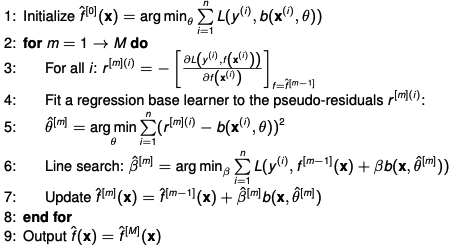

<!-- _paginate: false -->

# **Boosting in Cox Regression**

a comparison among the classical statistics-based, the likelihood-based and the model-based approaches with focus on the `AFT` model, R-packages `CoxBoost` and `mboost`

---

# **Outline** (1 min)

1. Introduction to Boosting
      - Component-wise boosting
      - The `Gradient Boosting` (Algorithm)
2. Cox model and applications
   - Cox model
   - Boosting with the three approaches (`AFT`, `mboost`, `CoxBoost`)
3. Comparison
4. Allowing for `mandatory covariates`
5. Application with the `mlr3` learner

---
# **Introduction to Boosting**

### Intro to the component-wise boosting (5 min)

1. Satisfying the two needs (for `high-dim` data)
   * variable selection
   * shrinkage of the coefficient to 0

2. Basic idea (motivation)
   * at each iteration, a weak learner is fitted on the modified version of data with the goal of minimizing the loss function

---
# **Introduction to Boosting**

### Intro to the component-wise boosting

3. Parameter to tune
   * penalty => "weakness"
   * stop criterion => M (avoid overfitting & control the sparsity)

---
# **Introduction to Boosting**

### Intro to the component-wise boosting

4. Gradient_boosting (fit the `pseudo-residuals`)
   * Forward stagewise additive modelling
Assume a regression problem and a space of base learners $\Beta$.
we want to learn an additive model:
$$f(x)=\sum_{m=1}^{M} \beta^{[m]}b(x,\theta^{[m]})$$ 

---
# **Introduction to Boosting**

### Intro to the component-wise boosting

4. Gradient_boosting (fit the pseudo-residuals)
   * Forward stagewise additive modelling
Hence, we minimize the empirical risk:
$$ R_{emp}(f)=\sum_{i=1}^{n} L(y^{(i)}, f(x^{(i)}))=\sum_{i=1}^{n} L(y^{(i)}, \sum_{m=1}^{M}\beta^{[m]}b(x^{(i)},\theta^{[m]})$$
---
# **Introduction to Boosting**

### Intro to the component-wise boosting

4. Gradient_boosting (fit the pseudo-residuals)
   * GBA with basic linear regression model

---
# **Cox model and applications**

### Cox model (6 min)

- Given: time-to-event data
  * $t$ is the n-dimention of the observed survival times
  * $x$ is the data, $n \times p$
  * $\delta$ is the n dimentional vector indicating whether the i-th observation is `censored` (if censored, then $\delta^{(i)}=1$)

---
# **Cox model and applications**

### Cox model

- The hazard function $\lambda (t|X)$
  * $\lambda (t|X) = \lambda_{0}(t) exp(X^{T}\beta)$ 
  * where $\beta$ is the `regression coefficient`
- MLE for $\beta$ with the partial likelihood
  * $pl(\beta)= \sum_{i=1}^{n} \delta_{i}(X^{(i)})^{T} \beta - log(\sum_{l \in R^{(i)}}exp\left \{{(X^{(l)})^{T}}\beta)  \right \}$
  
---
# **Cox model and applications**

### Cox model 

- Application with the `boosting` algorithm
  1. initialize the estimate, e.g. $\hat{F}(X)=constant$;
  2. compute the `pseudo-residual` vector: $u=-\frac{\partial L(y,F(X))}{\partial F(X)}$;
  3. compute the update by
        3.1 fit the base learner to the pseudo-residual vector,$\hat{h}(u,X)$;
        3.2 penalize the value, $\hat{f}(X)=v\hat{h}(u,X)$;
  4. update the estimate, $\hat{F}(X)=\hat{F}(X)+\hat{f}(X)$.
---
# **Cox model and applications**

### Cox model 

- Application with the `parametric` boosting algorithm
  1. initialize the estimate. e.g., $\hat{\beta}=(0,...,0)$;
  2. compute the `pseudo-residual` vector: $u=-\frac{\partial L(y,F(X,\beta))}{\partial F(X, \beta)}$;
  3. compute the update by
        3.1 fit the base learner to the pseudo-residual vector,$\hat{h}(u,X_{j})$;
        3.2 penalize the value, $\hat{b}_{j}=v \hat{h}(u, X_{j})$;
  4. select the best update and update the estimate, $\hat{\beta}_{j^{*}}=\hat{\beta}_{j^{*}}+\hat{b}_{j}$.
---
# **Cox model and applications** (5 min)

### The AFT model with flexible boosting
xxx

---
# **Cox model and applications**

### _mboost_ : `model-based` boosting for Cox regression
xxx

---
# **Cox model and applications**

### _CoxBoost_ : `likelihood-based` boosting for Cox model
xxx

---
# **Comparison** (5 min)

### Remark 1. 
...
### Remark 2. 
...
### Remark 3.
...

---
# **Allowing for mandatory covariates** (5 min)

### Background
...
### Favoring strategy in _surv.parametric_
...whether survival parametric? or mlr3proba or simply AFT
### Favoring strategy in _mboost_
### Favoring strategy in _CoxBoost_
  1.  penalty matrix
  2.  introdued before boosting procedures
...

---
# **Application with the mlr3 learner** (3 min)
xxxx
